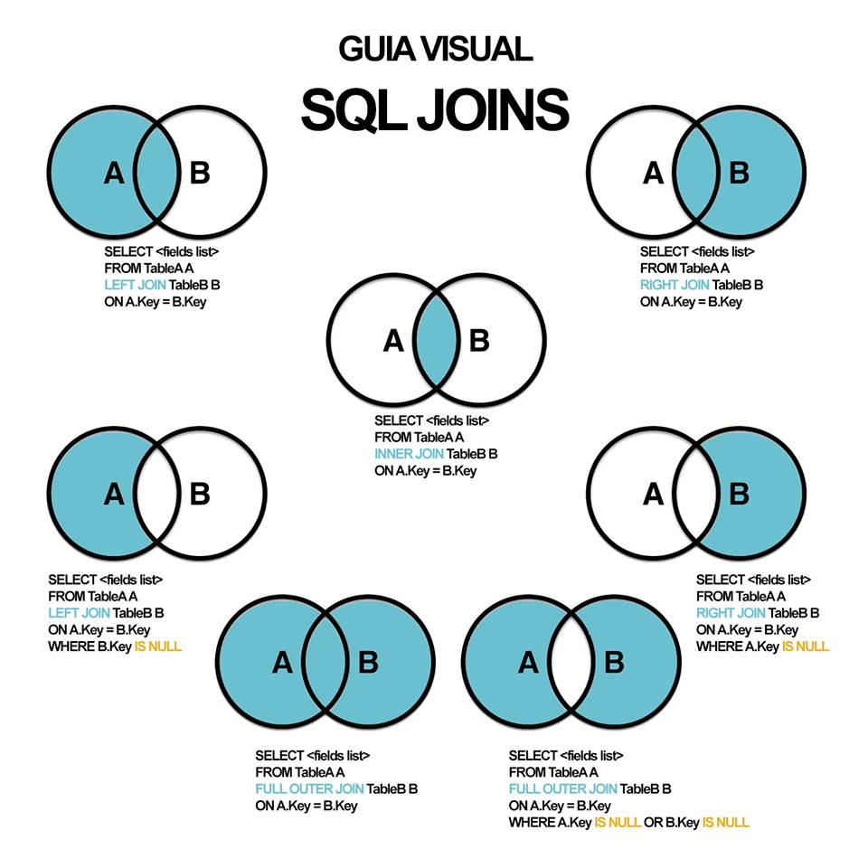
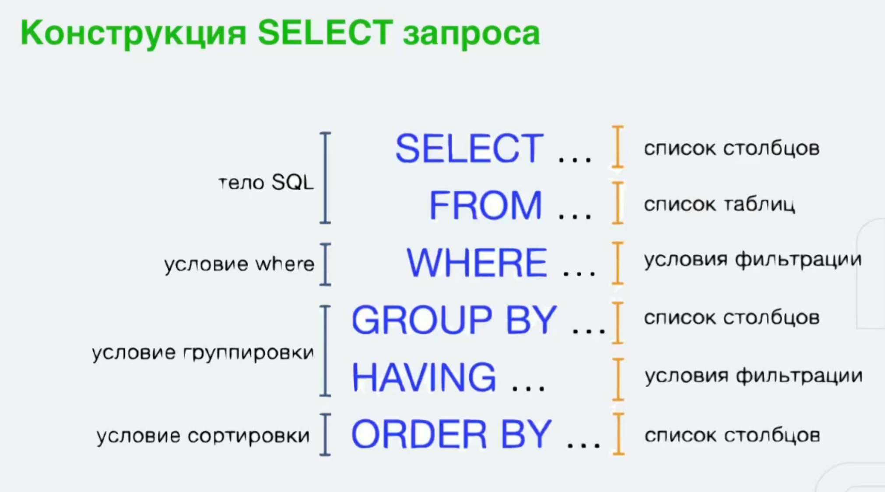

# Structured Query Language 

В контексте SQL (Structured Query Language) существуют различные категории операторов, которые используются для выполнения различных задач. 

1. `DDL (Data Definition Language)` - Язык определения данных: <br>
•	CREATE - создает новые объекты базы данных (таблицы, индексы и т.д.). <br>
•	ALTER - изменяет структуру существующих объектов базы данных. <br>
•	DROP - удаляет объекты базы данных. <br>
•	TRUNCATE - удаляет все данные из таблицы, но сохраняет структуру таблицы. <br>

DDL состоит из команд, которые используются для определения структуры базы данных или схемы.
Они позволяют создавать, изменять и удалять объекты базы данных.

<details>
  <summary>Примеры операторов DDL</summary>

**DML Операторы:**

1. **CREATE** - создание новых объектов базы данных.
    - Примеры:
        - `CREATE TABLE table_name (column1 datatype, column2 datatype, ...);`
        - `CREATE INDEX index_name ON table_name (column1, column2);`
        - `CREATE VIEW view_name AS SELECT column1, column2 FROM table_name;`
        - `CREATE DATABASE database_name;`
2. **ALTER** - изменение структуры существующих объектов базы данных.
    - Примеры:
        - `ALTER TABLE table_name ADD column_name datatype;`
        - `ALTER INDEX index_name RENAME TO index_name_new;`
        - `ALTER VIEW view_name AS SELECT column1, column2, column3 FROM table_name;`
5. **DROP** - удаление объектов базы данных.
    - Примеры:
        - `DROP TABLE table_name;`
        - `DROP INDEX index_name;`
        - `DROP VIEW view_name;`
        - `DROP DATABASE database_name;`
4. **TRUNCATE** - удаление всех данных из таблицы, но сохранение структуры таблицы.
    - Пример:
        - `TRUNCATE TABLE table_name;`
</details>

2. `DML (Data Manipulation Language)` - Язык манипулирования данными: <br>
•	SELECT - выбирает данные из базы данных. <br>
•	INSERT - вставляет новые данные в таблицу. <br>
•	UPDATE - обновляет существующие данные в таблице. <br>
•	DELETE - удаляет данные из таблицы.

`DML` включает операторы, которые используются для управления данными внутри базы данных. Они позволяют добавлять, изменять, удалять и извлекать данные из таблиц.

<details>
  <summary>Примеры операторов DML</summary>

1. **SELECT** - выбирает данные из одной или нескольких таблиц.
   - Примеры:
      - `SELECT * FROM table_name;`
      - `SELECT column1, column2 FROM table_name WHERE condition;`
2. **INSERT** - вставляет новые строки в таблицу.
   - Примеры:
      - `INSERT INTO table_name (column1, column2) VALUES (value1, value2);`
      - `INSERT INTO table_name VALUES (value1, value2, value3, ...);`
3. **UPDATE** - обновляет существующие данные в таблице.
   - Примеры:
      - `UPDATE table_name SET column1 = value1, column2 = value2 WHERE condition;`
4. **DELETE** - удаляет данные из таблицы.
   - Примеры:
      - `DELETE FROM table_name WHERE condition;`
      - `DELETE FROM table_name;` (удаляет все строки таблицы, но оставляет саму таблицу)
5. **MERGE** - объединяет данные из двух таблиц или представлений, обновляя или вставляя строки в зависимости от условия.(Этот оператор поддерживается не всеми СУБД)
    - Примеры:
        - `MERGE INTO target_table USING source_table ON condition WHEN MATCHED THEN UPDATE SET column1 = value1 WHEN NOT MATCHED THEN INSERT (column1, column2) VALUES (value1, value2);`
6. **RENAME** - переименование объектов базы данных.
    - Примеры:
        - `RENAME TABLE table_name TO new_table_name;`
        - `RENAME COLUMN column_name TO new_column_name;`
7. **COMMENT** - добавление комментариев к объектам базы данных.
    - Примеры:
        - `COMMENT ON TABLE table_name IS 'Table comment';`
        - `COMMENT ON COLUMN table_name.column_name IS 'Column comment';`
        - `COMMENT ON INDEX index_name IS 'Index comment';`
8. **LOCK TABLE** - блокировка таблицы для предотвращения изменений другими транзакциями.
    - Пример:
        - `LOCK TABLE table_name IN SHARE MODE;`
9. **EXPLAIN PLAN** - анализ и отображение плана выполнения запроса.
    - Пример:
        - `EXPLAIN PLAN FOR SELECT * FROM table_name;`
10. **CALL** - вызов хранимой процедуры или функции.
    - Пример:
        - `CALL procedure_name();`
</details>

3.	`DCL (Data Control Language)` - Язык управления данными: <br>
•	GRANT - предоставляет пользователям или ролям права на объекты базы данных. <br>
•	REVOKE - отзывает ранее предоставленные права. <br>

<details>
  <summary>Примеры операторов DCL</summary>

1. **GRANT** - предоставление прав доступа к объектам базы данных другим пользователям или ролям.
   - Пример:
      - `GRANT SELECT, INSERT ON table_name TO user_name;`
2. **REVOKE** - отзыв прав доступа к объектам базы данных у пользователей или ролей.
    - Пример:
        - `REVOKE SELECT, INSERT ON table_name FROM user_name;`
</details>

4.	`TCL (Transaction Control Language)` - Язык управления транзакциями: <br>
•	BEGIN - начинает новую транзакцию. <br>
•	COMMIT - фиксирует изменения, сделанные в текущей транзакции. <br>
•	ROLLBACK - отменяет изменения, сделанные в текущей транзакции. <br>
•	ROLLBACK TO SAVEPOINT - откатывает транзакцию до определенной точки сохранения. <br>
•	SAVEPOINT - создает точку сохранения внутри транзакции, к которой можно откатиться. <br>
•   RELEASE SAVEPOINT - удаляет точку сохранения из транзакции. <br>
•   SET TRANSACTION - устанавливает параметры транзакции. <br>
•	SAVE TRANSACTION - сохраняет состояние транзакции для последующего восстановления. <br>
      
TCL включает операторы, которые используются для управления транзакциями в базе данных. 
Транзакции используются для группировки операций базы данных в логические единицы работы.


### Операции над множествами

UNION - объединение множеств Пример:
UNION ALL - объединение множеств с дубликатами
EXCEPT / MINUS - разность множеств
EXCEPT ALL - разность множеств с дубликатами
INTERSECT - пересечение множеств
INTERSECT ALL - пересечение множеств с дубликатами


### Объединение таблиц


`INNER JOIN` - внутреннее соединение множеств. Возвращает записи, имеющие совпадающие значения в обеих таблицах.
```sql
SELECT columns
FROM table1
INNER JOIN table2
ON table1.column = table2.column;
```
`LEFT JOIN (или LEFT OUTER JOIN)` - левое соединение множеств
```sql
SELECT columns
FROM table1
LEFT JOIN table2
ON table1.column = table2.column;
```
`RIGHT JOIN  (или RIGHT OUTER JOIN)` - правое соединение множеств
```sql
SELECT columns
FROM table1
RIGHT JOIN table2
ON table1.column = table2.column;
```
`FULL JOIN (или FULL OUTER JOIN)` - полное соединение множеств. Возвращает все записи, когда есть совпадления в левой или правой таблице. Если совпадений нет, возвращаются NULL для соответствующей таблицы.
```sql
SELECT columns
FROM table1
FULL JOIN table2
ON table1.column = table2.column;
```
`CROSS JOIN` - декартово произведение множеств. Возвращает декартово произведение двух таблиц, т.е. все возможные комбинации записей из обеих таблиц.
```sql
SELECT columns
FROM table1
CROSS JOIN table2;
```
`NATURAL JOIN` - естественное соединение множеств. Возвращает записи, где совпадают столбцы с одинаковыми именами и типами в обеих таблицах.
```sql
SELECT columns
FROM table1
NATURAL JOIN table2;

SELECT columns
FROM table1
NATURAL LEFT JOIN table2;
```
`SELF JOIN` - соединение множеств самого с собой. Используется для соединения таблицы с самой собой. Например, для поиска сотрудников и их менеджеров, где менеджеры также являются сотрудниками.
```sql
SELECT A.columns, B.columns
FROM table A, table B
WHERE condition;

SELECT e.EmployeeID, e.FirstName, m.FirstName AS ManagerName
FROM Employees e
INNER JOIN Employees m ON e.ManagerID = m.EmployeeID;
```

`LATERAL JOIN:` - оператор используется для выполнения подзапроса для каждой строки основной таблицы.
Позволяет использовать подзапрос, который может ссылаться на столбцы из предыдущих таблиц в списке FROM.

```sql
SELECT columns
FROM table1,
LATERAL (SELECT * FROM table2 WHERE table2.column = table1.column) AS alias;
```

`JOIN с использованием оператора USING` - оператор USING используется для объединения таблиц по одному или нескольким столбцам, которые имеют одинаковые имена в обеих таблицах.

```sql
SELECT columns
FROM table1
JOIN table2
USING (column);
```

`JOIN с использованием подзапросов`
JOIN можно использовать с подзапросами для объединения результатов подзапросов с основной таблицей.

```sql
SELECT columns
FROM table1
JOIN (SELECT columns FROM table2) AS table2
ON table1.column = table2.column;
```

_____________

### Операторы SQL

AS - псевдонимы столбцов и таблиц
WHERE - фильтрация записей
```sql
SELECT * FROM Employees
WHERE HireDate > '2023-01-01';
```
LIKE - поиск по шаблону
```sql
SELECT * FROM Employees
WHERE LastName LIKE 'Smi%';
```
ORDER BY - сортировка результатов
```sql
SELECT * FROM Employees
ORDER BY LastName ASC;

SELECT * FROM Employees
ORDER BY LastName DESC;
```
GROUP BY - группировка результатов
```sql
SELECT DepartmentID, COUNT(*) as EmployeeCount
FROM Employees
GROUP BY DepartmentID;
```
HAVING - фильтрация групп. Оператор HAVING используется для фильтрации групп записей, возвращаемых оператором GROUP BY, на основе условия.
```sql
SELECT DepartmentID, COUNT(*) as EmployeeCount
FROM Employees
GROUP BY DepartmentID
HAVING COUNT(*) > 5;
```
DISTINCT - уникальные значения
```sql
SELECT DISTINCT DepartmentID
FROM Employees;
```
LIMIT - ограничение количества записей
```sql
SELECT * FROM Employees
LIMIT 10;


SELECT DepartmentID, COUNT(*) as EmployeeCount
FROM Employees
WHERE HireDate > '2023-01-01'
GROUP BY DepartmentID
HAVING COUNT(*) > 2
ORDER BY EmployeeCount DESC
    LIMIT 5;
```
OFFSET - смещение записей
```sql
SELECT * FROM Employees
ORDER BY LastName
LIMIT 10 OFFSET 20;
```
FETCH - ограничение количества записей. Оператор FETCH используется для ограничения количества возвращаемых строк в результатах запроса. 
Это часто используется в комбинации с OFFSET, чтобы реализовать пагинацию.
```sql
SELECT * FROM Employees
ORDER BY LastName
OFFSET 10 ROWS
    FETCH NEXT 5 ROWS ONLY;
```
IN - проверка на вхождение
```sql
SELECT * FROM Employees
WHERE DepartmentID IN (1, 2, 3);
```
BETWEEN - диапазон значений
```sql
SELECT * FROM Orders
WHERE OrderDate BETWEEN '2023-01-01' AND '2023-12-31';
```
IS NULL - проверка на NULL
```sql
SELECT * FROM Employees
WHERE Email IS NULL;
```
IS NOT NULL - проверка на NOT NULL
```sql
SELECT * FROM Employees
WHERE Email IS NOT NULL;
```


________________


SELECT - выборка данных<br>


INSERT - добавление данных
```sql
INSERT INTO Employees (FirstName, LastName, HireDate) VALUES ('John', 'Doe', '2024-01-01');
```
UPDATE - обновление данных
```sql
UPDATE Employees SET LastName = 'Smith' WHERE EmployeeID = 1;
```
DELETE - удаление данных
```sql
DELETE FROM Employees WHERE EmployeeID = 1;
```


GRANT - предоставление прав
```sql
GRANT SELECT, INSERT ON Employees TO user1;
```
REVOKE - отзыв прав
```sql
REVOKE SELECT, INSERT ON Employees FROM user1;
```

BEGIN - начало транзакции. Оператор BEGIN или BEGIN TRANSACTION обозначает начало новой транзакции, в рамках которой выполняются последующие операции.
```sql
BEGIN;
```
COMMIT - фиксация транзакции. Оператор COMMIT фиксирует изменения, сделанные в текущей транзакции, делая их постоянными и видимыми для других пользователей.
```sql
COMMIT;
```
END - конец транзакции. Оператор END или COMMIT завершает текущую транзакцию и фиксирует все изменения, если транзакция завершается успешно.
```sql
END;
```
ROLLBACK - откат транзакции. Оператор ROLLBACK отменяет все изменения, внесенные в рамках текущей транзакции, возвращая базу данных к состоянию до начала транзакции.
```sql
ROLLBACK;
```
SAVEPOINT - установка точки сохранения. Оператор SAVEPOINT устанавливает точку в текущей транзакции, до которой можно откатиться с помощью ROLLBACK.
```sql
SAVEPOINT sp1;
```


SET - установка параметров
```sql
SET search_path TO 'public';
Этот оператор устанавливает значение параметра search_path, который определяет порядок поиска схем при выполнении запросов.
```
SHOW - отображение параметров
DESCRIBE - отображение структуры объекта
EXPLAIN - отображение плана запроса. Оператор EXPLAIN используется для анализа и отображения плана выполнения запроса СУБД.
```sql
EXPLAIN SELECT * FROM Employees WHERE DepartmentID = 1;
```
ANALYZE - анализ запроса. Оператор ANALYZE используется для сбора статистики и анализа производительности запроса или таблицы.
CALL - вызов хранимой процедуры. Оператор CALL используется для вызова хранимой процедуры или функции в базе данных.
```sql
CALL CalculateSalary(123);
```
LOCK и UNLOCK - блокировка объекта и разблокировка объекта. Операторы LOCK и UNLOCK используются для управления 
блокировками объектов базы данных для обеспечения целостности данных в многопользовательской среде.
```sql
LOCK TABLE Employees IN SHARE MODE; --Этот оператор блокирует таблицу Employees для чтения, чтобы предотвратить изменения данных другими транзакциями.
     
UNLOCK TABLES; --Этот оператор разблокирует все таблицы, заблокированные предыдущим оператором LOCK.
```
USING - условие соединения по одноименным столбцам


